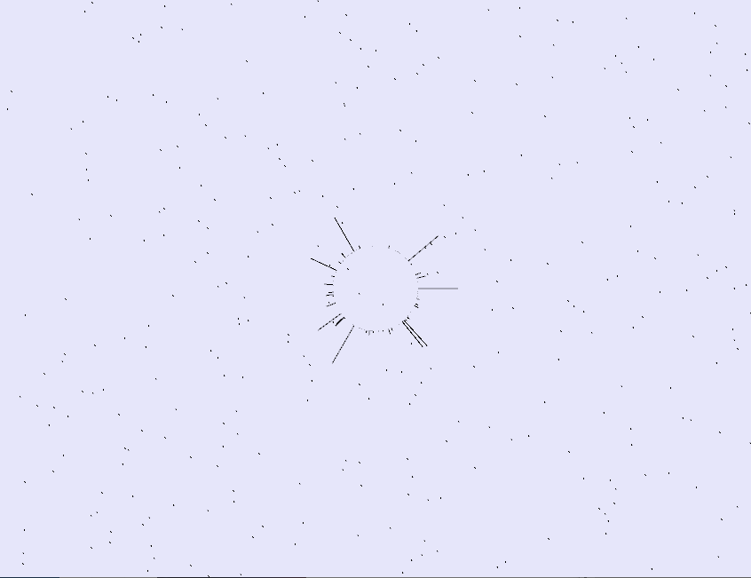

# Datos
Autor: Fernando Marcelo Alonso

Asignatura: Creando Interfaces de Usuario(CIU)

## Implementación y argumentación

Para la implementación he usado Processing 3.5.4.

**Vista:** Solo hay  una vista desde la que se observa una visualización de la canción que se encuentra reproduciendose, la visualización contiene una esfera con barras que marcan la intensidad de cada espectro de frecuencia también cambia de tamaño en función de la amplitud.

**Lluvia:** Para añadirle un poco de movimiento a la vista le añadi unas particulas de lluvia que se generan de forma aleatoria y caen hacía abajo.

**Barras esfera:** Para visualizar las distintas frecuencias y sus intensidades opte por poner en forma circular una serie de barras para cada frecuencia, cuanto mayor sea la barra mayor es la intensidad en dicha frecuencia.

**Latido esfera:** La esfera se agranda y disminuye en función de la amplitud, cuanto mayor sea la amplitud mayor es el tamaño y viceversa, cabe destacar que para que el cambio no sea excesivamente brusco el tamaño de la esfera depende de su valor actual y de su valor previo.

## GIF

